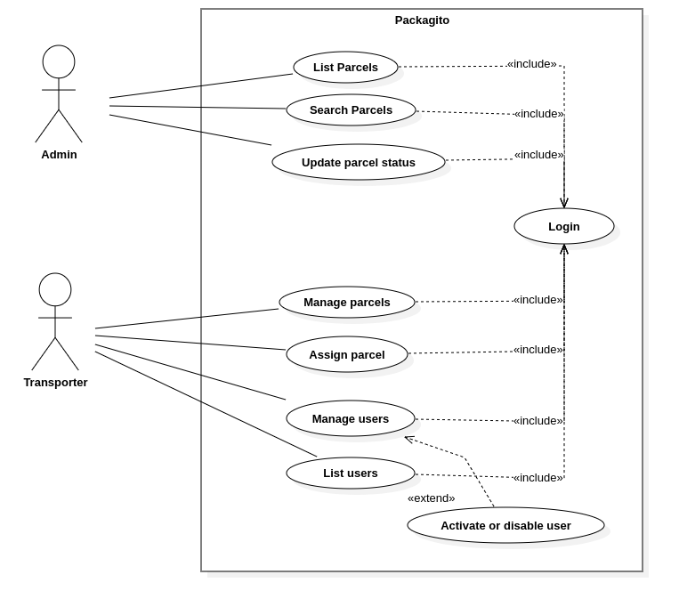
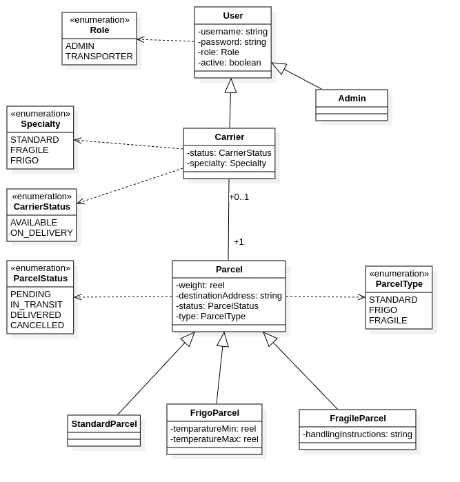

# Packagito 📦

**Packagito** is a comprehensive Parcel and Transporter Management Application designed to streamline logistics operations. Built with a modern tech stack centered around **Spring Boot** and **MongoDB**, it distinguishes between various parcel types (Standard, Fragile, Frigo) and employs strict role-based access control for Admins and Carriers.

## Features

- **Advanced Parcel Handling**:
  - 📦 **Standard Parcels**: Management for general goods.
  - 🧩 **Fragile Parcels**: Special handling protocols for delicate items.
  - ❄️ **Frigo Parcels**: Cold chain management for temperature-sensitive goods.
- **Role-Based Security**:
  - **Admins**: Full system oversight and user management.
  - **Carriers**: Task-specific access for delivery operations.
- **Secure Architecture**: robust authentication utilizing JWT (JSON Web Tokens) with refresh token rotation.
- **Developer Experience**:
  - Interactive API documentation with **Swagger UI**.
  - Fully containerized environment via **Docker**.
  - Automated CI/CD pipelines using **Jenkins**.

## Tech Stack

| Component | Technology |
|-----------|------------|
| **Core Framework** | Spring Boot 3.5.7 |
| **Language** | Java 21 |
| **Database** | MongoDB |
| **Security** | Spring Security, JWT (jjwt) |
| **Documentation** | SpringDoc OpenAPI (Swagger) |
| **Tooling** | Lombok, MapStruct, Maven |
| **DevOps** | Docker, Jenkins |

## System Design

### Use Case Diagram
High-level overview of system interactions and actor capabilities.



### Class Diagram
Conceptual domain model illustrating the hierarchy of Parcels and Users.



## Getting Started

### Prerequisites

Ensure you have the following installed:
- **Java 21** or higher
- **Docker** and **Docker Compose** (recommended)
- **Maven** (optional, wrapper provided)

### Configuration

1. **Clone the repository**:
   ```bash
   git clone https://github.com/kyojin/packagito.git
   cd packagito
   ```

2. **Set up Environment Variables**:
   Copy the example environment file to create your local configuration.
   ```bash
   cp .env.example .env
   ```
   
   Edit the `.env` file to match your local setup. Key variables include:

   | Variable | Description |
   |----------|-------------|
   | `SPRING_PORT` | Application port (default: `8080`) |
   | `SPRING_DATA_MONGODB_URI` | MongoDB connection string |
   | `JWT_SECRET_KEY` | Key for signing access tokens |
   | `ADMIN_INIT_LOGIN` | Default admin email |

### Running the Application

**Option 1: Using Docker (Recommended)**
Run the database and application services together.
```bash
docker-compose up -d --build
```

**Option 2: Manual Execution**
Ensure a MongoDB instance is running, then start the application:
```bash
./mvnw spring-boot:run -Dspring-boot.run.profiles=dev
```

## API Documentation

Once the application is running, explore the REST API via the Swagger UI:

[**Interactive API Docs**](http://localhost:8080/api/swagger-ui/index.html)

## Project Structure

The codebase follows a standard layered architecture:

- `src/main/java/.../entity`: **Domain Layer** - Core business objects (Parcel, User).
- `src/main/java/.../repository`: **Data Layer** - MongoDB repositories.
- `src/main/java/.../service`: **Service Layer** - Business logic and rules.
- `src/main/java/.../controller`: **Web Layer** - REST Controllers.
- `src/main/java/.../security`: **Security** - JWT filters and configurations.

## License

This project is licensed under the MIT License.